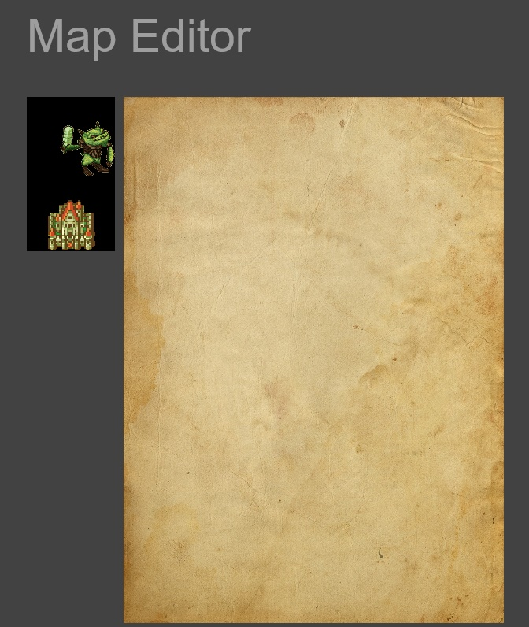
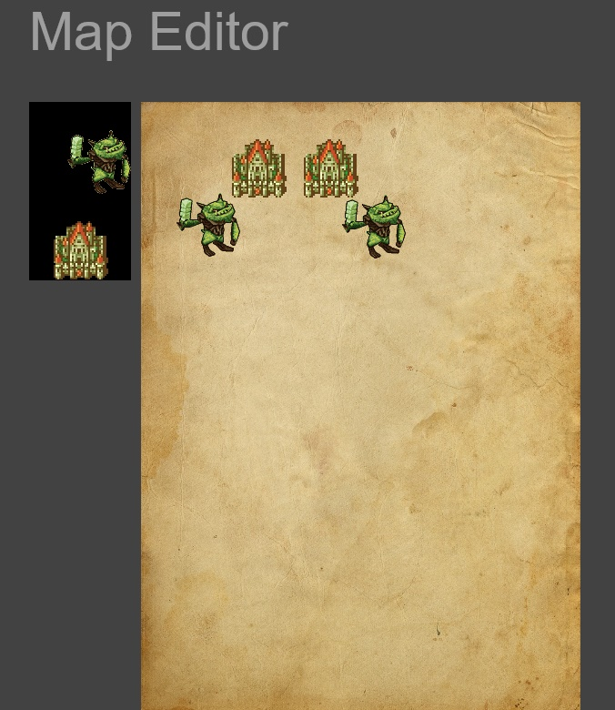
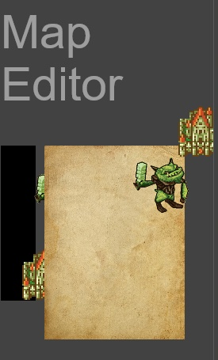

# Rol Map Editor
I started doing this project in order to implement it in a bigger university project im doing with my team. This projects implements a map editor for rol games like [anima](https://es.wikipedia.org/wiki/Anima:_Beyond_Fantasy), im doing it with html + jquery (since im new with jquery this is giving me some headaches).

The features this project will have are:
- Load differents map with their own configuration.
- Drag and drop sprites into the map.
- Re-position your sprites inside the map.
- Save the configuration of the maps (Coordinates of the sprites) on a database

Features it actually has:
- Drag and drop sprites into the map.
- Save the coordinates of the sprites but not in a database(yet)(with some issues).

I'm actually having a lot of problems saving the sprite's coordinates, I actually don't know how to get it correctly, it "works" if you just modify things in the same window's dimensions, if you change it the sprites won't be in the same place, if you change the dimensions again to the start dimensions, the sprites back to their position.
## Here you have an example.
- Map without editing:

  

- Map with editing(same dimensions).

  

This is giving me a lot of headaches because i don't really know how to save it,  I tried to make the image responsive with [MaterializeCSS](http://materializecss.com/) but it went crazy as i did.
- Resized window:

  

If you need something or have some tips for me, dont be shy and [contact](http://alvaroulpgc.github.io/contact.html) me
